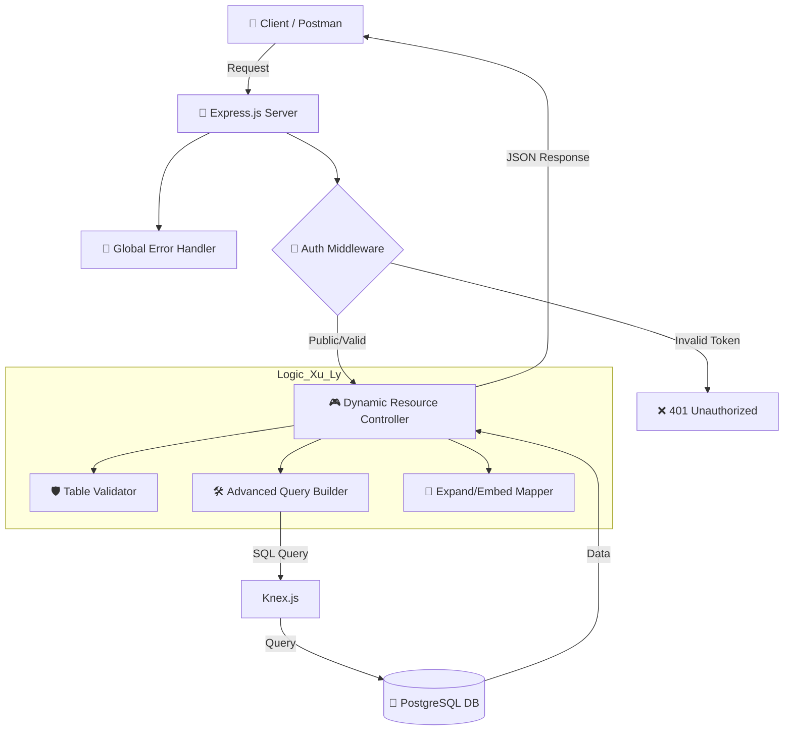

# 🚀 Smart API Hub (Node.js + PostgreSQL)

> **Dự án bài tập lớn:** Xây dựng nền tảng REST API tự động sinh (Dynamic API) từ file schema, mô phỏng lại `json-server` nhưng chạy trên nền tảng PostgreSQL bền vững.

---

## 🏗 Kiến trúc hệ thống (Architecture)

Dưới đây là sơ đồ luồng xử lý của một Request từ Client đến Database:



---

## 🛠 Công nghệ sử dụng (Tech Stack)

| Công nghệ         | Vai trò                     |
| :---------------- | :-------------------------- |
| **Node.js 22+**   | Runtime                     |
| **TypeScript**    | Ngôn ngữ (Strict Mode)      |
| **Express.js**    | Web Framework               |
| **PostgreSQL 15** | Cơ sở dữ liệu               |
| **Knex.js**       | Query Builder (Dynamic SQL) |
| **JWT & Bcrypt**  | Bảo mật & Mã hóa            |
| **Swagger UI**    | Tài liệu API tự động        |
| **Docker**        | Triển khai (Deployment)     |

---

## 🌟 Các tính năng nổi bật

- [x] **Auto-Migration:** Tự động đọc file `db.json`, suy luận kiểu dữ liệu và tạo bảng Postgres + Reset Sequence ID.
- [x] **Dynamic CRUD:** Hỗ trợ đầy đủ `GET`, `POST`, `PUT`, `PATCH`, `DELETE` cho mọi tài nguyên.
- [x] **Advanced Filtering:** Hỗ trợ so sánh `_gte`, `_lte`, `_ne`, `_like` (không phân biệt hoa thường).
- [x] **Pagination & Sorting:** Hỗ trợ `_page`, `_limit`, `_sort`, `_order` và trả về Header `X-Total-Count`.
- [x] **Relationships (No-Constraint):** Tự động liên kết dữ liệu cha-con qua `_expand` và `_embed` mà không cần khóa ngoại cứng trong DB.
- [x] **Security:** Bảo vệ các phương thức ghi dữ liệu bằng JWT. Riêng phương thức `DELETE` chỉ dành cho quyền `admin`.

---

## 🚀 Hướng dẫn cài đặt & Chạy (Setup)

### 1. Sử dụng Docker (Khuyên dùng)

Bạn chỉ cần chạy 1 lệnh duy nhất, hệ thống sẽ tự động cài đặt Node.js và Postgres:

```bash
docker-compose up --build
```

_Sau khi chạy, ứng dụng sẽ lắng nghe tại cổng `3000`._

### 2. Chạy thủ công (Local)

1. Cài đặt thư viện: `npm install`
2. Tạo database Postgres và cấu hình file `.env` (Dựa trên mẫu `.env.example`).
3. Chạy Server ở chế độ phát triển: `npm run dev`
4. Biên dịch và chạy Production: `npm run build && npm start`

---

## 📖 Tài liệu API (API Documentation)

### 🚩 Đường dẫn cơ bản

- **Swagger UI:** [http://localhost:3000/api-docs](http://localhost:3000/api-docs)
- **Health Check:** `GET /health` (Kiểm tra trạng thái Server và DB)

### 🔐 Authentication

- `POST /auth/register`: Đăng ký tài khoản (Role: `user` hoặc `admin`).
- `POST /auth/login`: Lấy Token JWT.

### 📊 Query Examples (Ví dụ truy vấn)

- **Lọc theo khoảng:** `GET /posts?views_gte=100&views_lte=500`
- **Tìm kiếm:** `GET /posts?q=nodejs`
- **Sắp xếp & Phân trang:** `GET /posts?_sort=id&_order=desc&_page=1&_limit=5`
- **Lấy dữ liệu cha (Expand):** `GET /posts?_expand=user`
- **Lấy danh sách con (Embed):** `GET /users?_embed=posts`

---

## 📁 Cấu trúc thư mục

```text
src/
├── config/        # Cấu hình DB, Swagger
├── controllers/   # Xử lý Logic Auth & Resource
├── db/            # Knex connection & Auto-migration
├── middlewares/   # Auth, Role, Error Handler
├── routes/        # Định nghĩa Route động
├── utils/         # Helper: Table validator, Singular/Plural
└── index.ts       # Entry point
```

---

## 📮 Postman Collection

Bộ sưu tập các yêu cầu API mẫu đã được export tại: `./Smart_API_Hub.postman_collection.json`. Bạn có thể Import vào Postman để test nhanh.

---

_Made with ❤️ by Nguyễn Viết Nam_
